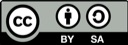

### 💸 Porque el que facturó dolares, recibirá... REPERFILANDO

Toda la información ¿actualizada? sobre el **Control Cambiario** (Cepo) establecido por el **[Decreto 609/2019](http://servicios.infoleg.gob.ar/infolegInternet/anexos/325000-329999/327566/norma.htm)** de Presidencia de la Nación Argentina y por la **[Comunicación "A" 6770](http://www.bcra.gov.ar/Pdfs/comytexord/A6770.pdf)** del BCRA.

Contenido destinado a personas físicas/humanas que realizan trabajos remotos para empresas, plataformas, clientes y contratantes en el exterior y reciben sus cobros vía Transferencia Bancaria Internacional.

`ADVERTENCIA: Esta web, su contenido, opiniones y demás información no implica asesoramiento legal y ante cualquier duda sobre su situación debe procurarse consultar profesionalmente con un Abogado o Contador matriculado.`

## 🔔 Puntos importantes a tener en cuenta

1. El llamado **Control Cambiario** rige desde el 01/09/2019 y se extenderá hasta el 31/12/2019 *(supuestamente)*.

2. Todo cobro en moneda extranjera por prestación de servicios al exterior **DEBE** liquidarse _(vender las divisas)_ en máximo 5 días hábiles *(según pto. 4 de la Com. "A" 6770 del BCRA)*.

3. Las acreditaciones automáticas de moneda extranjera en la cuenta bancaria del titular **quedan suspendidas**.

4. El titular destinatario de la transferencia tendrá que ir **personalmente** al sector de COMEX (Comercio Exterior) de la sucursal donde tiene radicada la cuenta bancaria para gestionar la liquidación de las divisas recibidas.

5. Deberá presentar la correspondiente **Factura E** que sustenta el cobro recibido y el respectivo formulario **Solicitud de Liquidación de Orden de Pago** *(o similar)* del banco correspondiente.

## ❗ Datos extra

- **Banco de la Nación Argentina**:
   - Manda un e-mail (con el nro. de ORPA) cuando reciben la transferencia y recién ahí puede ir a liquidarse.
   - Además, piden una DDJJ, por el momento de redacción libre, en la que consten los siguientes datos: NÚMERO y FECHA DE FACTURA correspondiente al cobro.

- **Banco Galicia**:
   - Habilitando el servicio **Galicia Office Banking** se puede autorizar la liquidacion de transferencias del exterior sin tener que llevar el formulario a la sucurcal fisicamente _(llamar al respectivo oficial de cuentas para más información)_.
      - [https://wsec06.bancogalicia.com.ar](https://wsec06.bancogalicia.com.ar)
      - [https://wsec06.bancogalicia.com.ar/Home/TermsAndConditions](https://wsec06.bancogalicia.com.ar/Home/TermsAndConditions)

- **Banco Santander**:
   - Exige que su **"FORMULARIO UNICO LIQUIDACION DE ORDENES DE PAGO DEL EXTERIOR"** sea completado enteramente por computadora incluyendo la fecha del día en que es presentado _(no admiten correcciones, subsanaciones y/o completado de datos a mano)_.

## 🗞 MalditoCepo en los medios

Finalmente los medios periodísticos se hicieron eco de la realidad que viven los freelancers frente a la **"pesificación"** forzosa de las transferencias internacionales en USD que están realizando los bancos argentinos en cumplimiento del pto. 4 de la  **[Comunicación "A" 6770](http://www.bcra.gov.ar/Pdfs/comytexord/A6770.pdf)** del BCRA al referirse que...

> _Los cobros de **exportaciones de servicios** deberán ser ingresados y **liquidados en el mercado local de cambios** en un plazo no mayor a los 5 (cinco) días hábiles a partir de la fecha de su percepción en el exterior o en el país, o de su acreditación en cuentas del exterior_

 - [12/09/2019 - **El cepo cambiario también afecta a profesionales que prestan servicios en el exterior** (ambito.com)](https://www.ambito.com/el-cepo-cambiario-tambien-afecta-profesionales-que-prestan-servicios-el-exterior-n5054172)
 
 - [17/09/2019 - **Monotributistas deberán pesificar cobro de servicios al exterior pero antes podrán pagar deudas en moneda extranjera** (cronista.com)](https://www.cronista.com/economiapolitica/Monotributistas-deberan-pesificar-cobro-de-servicios-al-exterior-pero-antes-podran-pagar-deudas-en-moneda-extranjera-20190917-0023.html)
 
 - [17/09/2019 - **Control de cambios. Pesifican los pagos en dólares para trabajos hechos para otros países** (lanacion.com.ar)](https://www.lanacion.com.ar/economia/control-cambios-ya-no-se-puede-trabajar-nid2288608)

 - [17/09/2019 - **Los “freelancers” están obligados a pesificar sus ingresos y además, pierden un 7% con el tipo de cambio** (clarin.com)](https://www.clarin.com/economia/economia/freelancers-obligados-pesificar-ingresos-ademas-pierden-7-tipo-cambio_0_RjiD8At.html)

 - [17/09/2019 - **Los trabajos personales realizados para clientes de otros países ahora sólo se podrán cobrar en pesos** (infobae.com)](https://www.infobae.com/economia/finanzas-y-negocios/2019/09/17/los-trabajos-personales-realizados-para-clientes-de-otros-paises-ahora-solo-se-podran-cobrar-en-pesos/)

 - [17/09/2019 - **Se pesifican los pagos para los que hagan trabajos para el exterior** (perfil.com)](https://www.perfil.com/noticias/economia/pesifican-pagos-los-que-hagan-trabajos-exterior.phtml)

 - [18/09/2019 - **El que factura dólares ¿cobra dólares?: cómo los profesionales pueden saltar cepo a la venta de servicios al exterior** (iproup.com)](https://www.iproup.com/mundo-fintech/7476-divisa-pesificacion-freelance-Cepo-al-dolar-como-impacta-en-la-exportacion-de-servicios)

## 📋 Datos requeridos para completar el formulario de Liquidación de Orden de Pago

**- Datos del beneficiario _(el que cobra)_:**
* Nombre completo
* DNI/CUIT/CUIL
* Nacionalidad
* Domicilio
* etc.

**- Datos del ordenante _(el que paga)_:**
* Nombre completo o Razón Social
* Domicilio
* País
* etc.

_(Estos y otros datos más se pueden obtener del email/mensaje SWIFT enviado por el banco desde el area de Comercio Exterior que notifica la recepción de la transferencia)_

**- Datos de la transferencia:**
* Nombre y Nro. de la cuenta bancaria ordenante _(la que pagó)_
* Nro. de la cuenta bancaria beneficiaria _(la que recibirá)_
* Monto 
* Cód. SWIFT
* Cód. de Concepto

### 🏷 Códigos de Concepto ###

Son "categorías" establecidas por el **BCRA** que indican el motivo que justifica la transferencia.

A veces en la **Orden de Pago** que notifica el banco receptor lo indica _(vendría a ser el Cod. que cargó el pagador que envía los USD)_. Otras veces no lo indica y es el banco quien le pide al beneficiario que lo indiquen en el formulario de liquidación para cotejar que sea el mismo que puso el otro.

> CONSEJO: chequear los recibos y/o comprobantes que envían los contratantes/empleadores para obtener los datos de ahí y evitar que les reboten el formulario.

Este es el listado de Códigos de Conceptos:

[📄 Operaciones de Cambio - Códigos de Conceptos](formularios/bcra_cod_de_concepto.pdf)

Y estos son algunos códigos de conceptos comunes en lo relativo a trabajo remoto para el exterior:
```
S13 - Servicios de informática
S16 - Servicios de investigación y desarrollo
S21 - Servicios relacionados con el comercio
S23 - Servicios audiovisuales y conexos
S24 - Otros servicios personales, culturales y recreativos
```

**Recordatorio:** En principio, toda liquidación de transferencias recibidas bajo concepto de Servicios será LIQUIDADA EN PESOS según lo reglamentado por la **[Comunicación "A" 6770](http://www.bcra.gov.ar/Pdfs/comytexord/A6770.pdf)** del BCRA.

> Off the record: para lograr recibir la liquidación en **USD**, tratar de "negociar" con el contratante/empleador para que se haga la transferencia bajo el concepto **I07 - Transferencias personales** _(mejor aún si el que paga una persona fisica/humana)_... o bajo el concepto **I08 - Otras Transferencias Corrientes** _(quizás por un monto chico/mediano puede hacerse pasar por **Beca y Gastos de Estudio** si la transferencia la hace una empresa y justo uno está estudiando)_

`ADVERTENCIA: Consultar profesionalmente con un Abogado/Contador matriculado sobre los posibles efectos legales-fiscales individuales que cada uno pueda tener frente a las acciones a tomar.`

## 📄 Formularios para solicitar liquidación de cobros desde el exterior (en desarrollo...)

 - [Banco Nación (para Personas Humanas)](formularios/banco_nacion_cartera_consumo.pdf)  
 - [Banco Nación (para Personas Jurídicas)](formularios/banco_nacion_cartera_comercial.pdf)
 - [Banco Nación - DDJJ Lavado de Activos](formularios/banco_nacion_F-62190_ddjj_lavado_activos.doc)
 - [Banco de la Provincia de Buenos Aires](formularios/banco_provincia_bsas.pdf)
 - [Banco Ciudad](formularios/banco_ciudad.xlsx)
 - [Banco BBVA](formularios/banco_bbva.pdf)
 - [Banco Galicia](formularios/banco_galicia.pdf)
 - [Banco Santander](formularios/banco_santander.pdf)
 - [Banco HSBC](formularios/banco_hsbc.doc)
 - [Banco ICBC](formularios/banco_icbc.docx)
 - [Banco Comafi](formularios/banco_comafi.doc)

## 📣 Acerca de...

MalditoCepo es una publicación de **Legalizá tu Proyecto - Inteligencia Legal para Emprendedores** ([legalizatuproyecto.com](https://legalizatuproyecto.com))

Repositorio oficial: [https://github.com/smessina/MalditoCepo](https://github.com/smessina/MalditoCepo)

Sugerencias y colaboraciones: [malditocepo@legalizatuproyecto.com](mailto:malditocepo@legalizatuproyecto.com)

¿Sale un café?:

|☕️|Si, dale!|
|:-:|:-|
|☕️ x 1|[Pedite un cortado!](https://www.mercadopago.com/mla/checkout/start?pref_id=37082978-c9044b6f-47c8-4d2c-9640-98f28f138acb)|
|☕️ x 2|[Pidamos dos](https://www.mercadopago.com/mla/checkout/start?pref_id=37082978-a1c43d34-2e3a-4cb4-b480-135ecd1f9b0b)|
|☕️ x 3|[Donde toman dos, toman tres](https://www.mercadopago.com/mla/checkout/start?pref_id=37082978-4316faff-7b2c-4409-907d-da3cb4b6b881)|
|☕️ x 4|[Dos para hoy y dos para mañana](https://www.mercadopago.com/mla/checkout/start?pref_id=37082978-990fdcb2-bc9a-48ae-83e9-3e21d84c3670)|
|☕️ x 5|[Café para toda la semana](https://www.mercadopago.com/mla/checkout/start?pref_id=37082978-64fafd0d-fdaa-4805-afea-26c8d90bf22d)|
||Mejor un cripto-café:<br>[_3GU3s5mY9MFPKNxJ9bYnuhdq1Df69Mr39f_](bitcoin:3GU3s5mY9MFPKNxJ9bYnuhdq1Df69Mr39f)|

---



Los textos publicados en esta obra están sujetos (excepto que se indique lo contrario) a una licencia de Atribución-CompartirIgual (BY-SA) v.4.0 Internacional de Creative Commons. Se puede modificar la obra, reproducirla, distribuirla o comunicarla públicamente siempre que se cite el autor, la/s fuente/s y siempre que la obra derivada quede sujeta a la misma licencia que el material original. La licencia completa se puede consultar en: [https://creativecommons.org/licenses/by-sa/4.0/deed.es](https://creativecommons.org/licenses/by-sa/4.0/deed.es)
